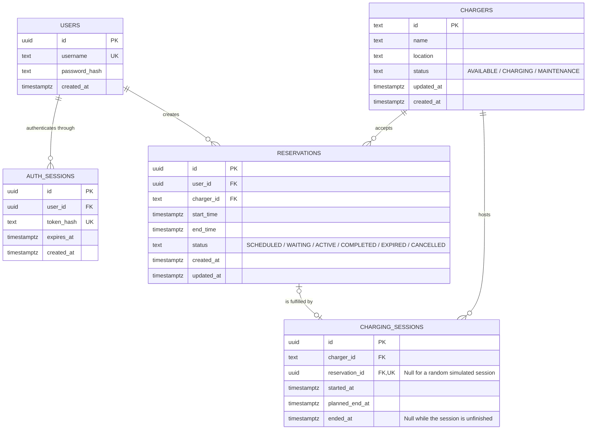

# Database Design

User primary keys and all foreign keys referencing users use UUIDs. The API represents `user_id` as a UUID string. Charger IDs remain text to preserve the assessment's required `charger-1` fixture.

## Constraints and Relationships

- Non-cancelled reservation intervals `[start_time, end_time)` must not overlap for the same charger. Cancelled rows stay in history without holding their former time slots. `end_time` must be later than `start_time`.
- Each charger may have at most one unfinished charging session.
- Each reservation may have at most one charging session. A null `reservation_id` indicates random simulated use; otherwise, the user is identified through the linked reservation.
- A session linked to a reservation must belong to the same charger as that reservation.
- A session's planned end time must be later than its start time. Its actual end time, when present, must not precede its start time.
- Charger state changes and session start or end updates must occur in the same transaction.
- Both reservation creation and simulated session creation lock the corresponding charger before checking occupancy and writing changes.
